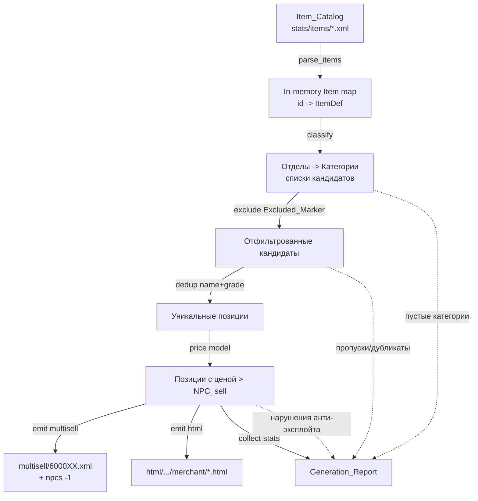
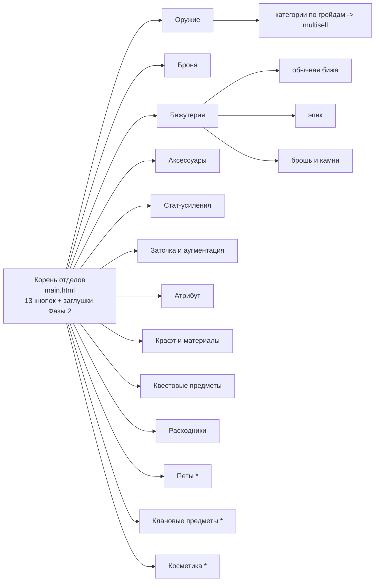

# Design Document — Alt+B Shop Overhaul (Магазин за адену)

## Overview

Эта фича — полная переработка магазина за адену в меню Alt+B (Community Board) соло-сервера
Lineage 2 Grand Crusade на движке L2J Mobius. Дизайн описывает, как единственный генератор
`tools/shopgen.py` (Shop_Generator) превращает определения предметов Mobius
(`server/game/data/stats/items/*.xml`, далее Item_Catalog) в:

1. **Мультиселлы** — `server/game/data/multisell/6000XX.xml` (списки товаров: ингредиент = адена, продукт = предмет);
2. **HTML-меню** — `server/game/data/html/CommunityBoard/Custom/merchant/*.html` (страница отделов + страницы категорий);
3. **Generation_Report** — текстовый отчёт о покрытии, пропусках, пустых категориях и нарушениях анти-эксплойта.

Наполнение НЕ требует пересборки jar: генератор пишет только данные (XML + HTML), а изменения применяются рестартом сервера
(Требования 19.1–19.6).

### Цели дизайна (что реализуем)

- Единая структура из **13 отделов** с двух-кликовой навигацией и структурным заделом под Фазу 2 (Требование 1).
- Полное покрытие оружия и брони по грейдам, обычной и эпик-бижи, брошей/камней, браслетов, талисманов,
  красок, стат-шапок, плащей/поясов/агатионов, заточки/аугментации, атрибутов, крафта/материалов/квест-предметов,
  расходников (Требования 2–14).
- Детерминированная классификация предметов по отделам/категориям, дедупликация `name+crystal_type`,
  правила исключения (Excluded_Marker) (Требования 2–14, 18).
- Анти-эксплойт по цене (цена покупки строго > NPC_Sell_Price) через формулу-заглушку — без точного балансового прохода (Требования 15, 20.1).
- Проверяемое соответствие эталону L2Scripts и актуальной хронике Grand Crusade (Требования 16, 17).

### Не-цели (out of scope, но с заделом)

- Точный балансовый проход по конкретным ценам (Требование 20.1) — задаём только формулу-заглушку.
- Java-сервисы Фазы 2 (профессии, топы, Герой) и ослабление эпик-боссов (Требование 20.2) — резервируем места-заглушки (Требование 1.9, 20.3).

### Исследование, повлиявшее на дизайн

- **Item_Catalog Mobius** (`server/game/data/stats/items/*.xml`): предметы имеют атрибуты `id`, `name`, `additionalName`, `type`
  (`Weapon`/`Armor`/`EtcItem`) и вложенные `<set name="crystal_type" val="…">` (грейд), `<set name="bodypart" val="…">`,
  `<set name="price" val="…">` (= NPC_Sell_Price), `<set name="armor_type" val="HEAVY|LIGHT|MAGIC">`. Пример: `Seraph Boots` id=17400,
  grade R95, bodypart feet, price 38 327 000.
- **Текущий `shopgen.py`**: содержит рабочую основу (regex-парсер, dedup-by-name, шаблоны multisell/HTML на русском), но имеет
  расхождения с требованиями, которые дизайн устраняет (см. «Расхождения с текущей реализацией»).
- **Эталон L2Scripts** (`l2scripts/dist/gameserver/data/multisell/gmshop/1000001.xml` и др.): «Adena Shop» расфасован по грейдам и типам
  (напр. Soulshots по D/C/B/A/S/R), использует `<config show_all no_tax keep_enchanted>` и `<ingredient id="57">`. Это подтверждает
  расфасовку «по грейду/типу» как эталонную гранулярность (Требование 16.2).
- **Хроника Grand Crusade** (сверка в интернете): эндгейм-грейды — R (Apocalypse/Twilight), R95 (Specter/Seraph), R99 (Amaranthine/Eternal);
  эпик-боссы бижи — Queen Ant, Orfen, Core, Zaken, Baium, (Antharas), Frintezza, Valakas; семейства камней брошей — Ruby/Sapphire/Emerald/
  Diamond/Opal/Obsidian/Pearl/Vital Spirit/Cat's Eye/Garnet/Tanzanite/Aquamarine ([Raid Boss Jewelry, fandom](https://lineage2.fandom.com/el/wiki/Raid_Boss_Jewelry); [l2wiki Recipes](https://l2wiki.com/Recipes)). Содержимое было переформулировано для соответствия лицензионным ограничениям.

### Расхождения с текущей реализацией (устраняются этим дизайном)

| # | Текущее поведение | Требование | Изменение в дизайне |
|---|---|---|---|
| 1 | `BASE` указывает на `mobius-src/…/dist/game/data` | 19.5 | Пути к данным активного сервера `server/game/data` (конфигурируемо через CLI/env) |
| 2 | Мультиселлы БЕЗ блока `<npcs><npc>-1</npc></npcs>` | 19.2 | Каждый мультиселл содержит `<npcs><npc>-1</npc></npcs>` |
| 3 | 8 отделов, ~20 категорий | 1.1 | 13 отделов, покрытие всех классов, заделы Фазы 2 |
| 4 | Фиксированная цена на категорию (`CAT_PRICE`) | 15.1 | Цена = функция от `price`/грейда с гарантией `> NPC_Sell_Price` |
| 5 | Дедуп по `name` | 2.5/3.6/4.5 | Дедуп по ключу `(name, crystal_type)` → минимальный `id` |
| 6 | Нет отчёта | 18.4, Generation_Report | Формируется `Generation_Report` |

## Architecture

### Конвейер генерации (pipeline)



### Слои и ответственность

- **Data Access слой** (`parse_items`): читает Item_Catalog, строит карту `id → ItemDef`. Единственный источник имени/грейда/цены
  (Требование 18.2).
- **Classification слой** (`classify_*`): чистые функции, назначающие предмету отдел/категорию по правилам (тип, грейд, bodypart,
  паттерны имени, семейства). Реализует Требования 2–14, 17.
- **Filtering слой** (`is_excluded`, `dedup`): применяет Excluded_Marker и дедупликацию `(name, crystal_type)` → минимальный `id`
  (Требования 2.4–2.5, 3.5–3.6, 4.4–4.5, 6.4, 7.3–7.4, 8.3–8.4, 10.3–10.4, и т.д.).
- **Pricing слой** (`buy_price`): формула-заглушка, гарантирующая цену покупки строго > NPC_Sell_Price (Требование 15).
- **Emit слой** (`write_multisell`, `build_html`): пишет XML-мультиселлы (с `<npcs>-1`) и HTML-меню (Требования 19.1–19.3).
- **Report слой** (`Generation_Report`): агрегирует счётчики, пропуски, пустые категории, нарушения (Требования 5.6, 9.5, 11.5, 13.5, 14.5, 18.3–18.5).

### Структура навигации Alt+B (13 отделов)



`*` — отделы с задельными местами Фазы 2; их товары в рамках этой фичи не добавляются, но кнопки/страницы-заглушки видны (Требования 1.9, 20.3).

Навигация двухуровневая: корень → отдел → категория (multisell). Любая категория достижима ≤ 2 кликов (Требование 1.6):
клик 1 — кнопка отдела, клик 2 — кнопка категории. Каждая страница отдела имеет ровно одну кнопку «◄ В отделы»
(Требование 1.4); каждый открытый multisell вызывается со страницы своего отдела, куда ведёт кнопка возврата (Требование 1.5).
Существующие разделы (Баффер, Телепорт, Поиск дропа, Понижение уровня, Премиум) сохраняются в корневой навигации без изменений
их целевых страниц (Требование 1.8).

## Components and Interfaces

Все компоненты — функции внутри `tools/shopgen.py` (Python 3, только стандартная библиотека). Ниже — контракты (сигнатуры и инварианты).

### 1. `parse_items(items_dir) -> dict[int, ItemDef]`
- **Вход**: путь к `stats/items`.
- **Выход**: карта `id → ItemDef` (см. Data Models).
- **Инвариант**: ключ = `id` из определения; `name`, `grade` (crystal_type), `price` (NPC_Sell_Price), `bodypart`, `type`, `armor_type` берутся из XML (Требование 18.2). Некорректные/неполные блоки пропускаются и логируются в отчёт.

### 2. `classify(item) -> (department_key, category_key) | None`
- Чистая функция классификации по правилам (см. «Правила классификации»). Возвращает `None`, если предмет не относится ни к одной категории.
- **Инвариант**: каждый предмет попадает максимум в одну категорию → категория принадлежит ровно одному отделу (Требование 1.7).

### 3. `is_excluded(item, category_key) -> bool`
- Возвращает `True`, если `name` содержит любой Excluded_Marker для данной категории (см. «Правила исключения»).
- **Инвариант**: исключённые предметы не попадают в вывод (Требования 2.4, 3.5, 4.4, 5.5, 6.4, 7.3, 8.3, 10.3, 11.4, 12.5, 13.4, 14.4).

### 4. `dedup(items) -> list[ItemDef]`
- Группирует по ключу `(name, crystal_type)`, оставляет предмет с минимальным `id`.
- **Инвариант**: в результирующем списке нет двух предметов с одинаковыми `(name, grade)` (Требования 2.5, 3.6, 4.5); для браслетов/талисманов/шапок ключ — `name` (Требования 7.4, 8.4, 10.4).

### 5. `buy_price(item, category_rules) -> int`
- Возвращает цену покупки в адене, строго большую `NPC_Sell_Price` (см. «Модель ценообразования»).
- **Инвариант**: `buy_price(item) > item.price` для всех позиций (Требование 15.1); при `price` неизвестном/0 применяется неотрицательный грейд-минимум (Требование 15.2).

### 6. `write_multisell(msid, entries)`
- Пишет `multisell/{msid}.xml` c блоком `<npcs><npc>-1</npc></npcs>`, ингредиентом `id="57"` и производством `id`/`count`.
- **Инвариант**: единственный ингредиент — адена id 57 (Требование 15.3); присутствует `<npcs>-1` (Требование 19.2).

### 7. `build_html(structure) -> None`
- Генерирует `main.html` (13 отделов + заглушки) и по одной странице на отдел с кнопками категорий, кнопкой «◄ В отделы» и кнопкой возврата к отделу для категорий.
- **Инвариант**: ровно одна кнопка «◄ В отделы» на странице отдела (Требование 1.4); ≤ 2 клика до любой категории (Требование 1.6).

### 8. `emit_report(report) -> None`
- Пишет Generation_Report: число позиций по категориям, общее число, пропуски, пустые категории, нарушения анти-эксплойта (Требования 18.4–18.5).

### CLI / конфигурация путей (Требование 19.5)

```
python tools/shopgen.py --data-dir server/game/data [--dry-run] [--report shop_report.txt]
```
- `--data-dir` по умолчанию — путь к данным активного сервера `server/game/data` (не `mobius-src`).
- `--dry-run` — генерация в память + отчёт без записи (для валидации).
- Если каталоги `multisell` или `html/.../merchant` недоступны для записи — генерация прекращается с ошибкой записи (Требование 19.6).

## Data Models

### ItemDef (нормализованное определение предмета)

| Поле | Тип | Источник в XML | Назначение |
|---|---|---|---|
| `id` | int | `item@id` | идентификатор товара (Требование 18.1) |
| `name` | str | `item@name` | имя, ключ дедупа, комментарий в multisell |
| `additional_name` | str | `item@additionalName` | подсказка типа (напр. «Heavy Armor») |
| `type` | str | `item@type` | `Weapon`/`Armor`/`EtcItem` |
| `grade` | str | `set[crystal_type]` | D/C/B/A/S/S80/R/R95/R99/NG |
| `bodypart` | str | `set[bodypart]` | слот (`chest`,`rfinger;lfinger`,`talisman`,`brooch`,`rbracelet`,`back`,`waist`,`hairall`…) |
| `armor_type` | str | `set[armor_type]` | HEAVY/LIGHT/MAGIC (robe) |
| `price` | int | `set[price]` | NPC_Sell_Price (Требование 15) |

### Category (описание категории)

| Поле | Тип | Назначение |
|---|---|---|
| `key` | str | техключ (напр. `weapon_r99`) |
| `title_ru` | str | подпись кнопки (напр. «Оружие R99») |
| `department` | str | родительский отдел (ровно один — Требование 1.7) |
| `multisell_id` | int | id файла `6000XX.xml` |
| `selector` | callable | правило отбора предметов |
| `price_rule` | PriceRule | правило ценообразования |

### Multisell entry (строка товара)

```xml
<item>
    <ingredient id="57" count="{buy_price}" />
    <production id="{item.id}" count="{count}" /> <!-- {item.name} -->
</item>
```
Обёрнуто в `<list>` с блоком `<npcs><npc>-1</npc></npcs>` (Требования 15.3, 19.2).

### Карта отделов → категорий → диапазонов multisell-id

Диапазон `6000XX` разбит на декадные блоки по отделам; внутри блока ~2 свободных слота на рост, а отделы Петы/Клан/Косметика и весь блок `6001XX` зарезервированы под Фазу 2 (Требования 1.9, 20.3). Категория создаётся только если в Item_Catalog есть хотя бы один подходящий предмет — иначе фиксируется в отчёте и файл не пишется (Требования 2.6, 5.6, 11.5, 14.5).

| Отдел | Req | Категории (пример ключей) | Диапазон multisell-id |
|---|---|---|---|
| 1. Оружие | 2, 16, 17 | `weapon_{d,c,b,a,s,s80,r,r95,r99}` | 600001–600009 |
| 2. Броня | 3, 16, 17 | `armor_{d,c,b,a,s,s80,r,r95,r99}` | 600010–600019 |
| 3. Бижутерия | 4, 5, 6 | обычная бижа по грейдам `jewel_{a,s,s80,r,r95,r99}` (600020–600025); `jewel_epic` (600028); `brooch_and_jewels` (600029) | 600020–600029 |
| 4. Аксессуары | 7, 11 | `bracelets` (600030), `cloaks` (600031), `belts` (600032), `agathions` (600033) | 600030–600039 |
| 5. Стат-усиления | 8, 9, 10 | `dyes` (600040), `stat_hats` (600041), `talismans` (600042) | 600040–600049 |
| 6. Заточка и аугментация | 12 | `enchant_weapon` (600050), `enchant_armor` (600051), `life_stones` (600052) | 600050–600059 |
| 7. Атрибут | 13 | `attribute_weapon` (600060), `attribute_armor` (600061) | 600060–600069 |
| 8. Крафт и материалы | 14 | `materials` (600070), `recipes` (600071), `crystals` (600072) | 600070–600079 |
| 9. Квестовые предметы | 14 | `quest_items` (600080) | 600080–600084 |
| 10. Расходники | 12.4, 16 | `shots` (600085), `potions` (600086) | 600085–600089 |
| 11. Петы | 1.9, 20.3 | *(задел Фазы 2)* | 600090–600092 |
| 12. Клановые предметы | 1.9, 20.3 | *(задел Фазы 2)* | 600093–600095 |
| 13. Косметика | 1.9, 20.3 | *(задел Фазы 2)* | 600096–600099 |
| — Фаза 2 (профессии/топы/Герой) | 20.3 | *(зарезервировано)* | 600100–600199 |

### Правила классификации

**Грейд-маппинг**: `crystal_type` ∈ {`NG`/пусто, `D`, `C`, `B`, `A`, `S`, `S80`, `R`, `R95`, `R99`}.

**Оружие** (Требование 2): `type == "Weapon"`, `bodypart` ∈ {`rhand`,`lrhand`}. Тип оружия определяется по суффиксу имени/`additionalName`
(Sword, Blunt, Dagger, Bow, Pole, Fist, Dual Sword, Dual Dagger, Dual Blunt, Crossbow, Rapier, Ancient Sword, Two-Handed, Magic).
Категория — по грейду. Эндгейм-линейки R/R95/R99 (Apocalypse/Specter/Amaranthine или актуальные аналоги) включаются как оружие соответствующего грейда (Требование 2.3).

**Броня** (Требование 3): `type == "Armor"`, `bodypart` ∈ {`chest`,`legs`,`feet`,`gloves`,`head`,`alldress`,`onepiece`}. `armor_type` (heavy/light/robe)
сохраняется как под-тип. Категория — по грейду. Эндгейм-линейки R/R95/R99 (Twilight/Seraph/Eternal) включаются (Требование 3.4).

**Обычная бижутерия** (Требование 4): `type == "Armor"`, `bodypart` ∈ {`neck`, `rear;lear`, `rfinger;lfinger`}, НЕ эпик (см. ниже). Категория — по грейду {A,S,S80,R,R95,R99}.

**Эпик-бижутерия** (Требование 5): распознаётся по принадлежности имени к боссам {Queen Ant, Orfen, Core, Zaken, Baium, Antharas, Frintezza, Valakas}
(паттерны имён + справочный whitelist id). Всегда в отдельной категории `jewel_epic`, обособленной от обычной бижи (Требование 5.1).

**Брошь и камни брошей** (Требование 6): `bodypart` ∈ {`brooch`, `brooch_jewel`}. Сама Brooch (La Vie En Rose's и производные) + семейства
{Ruby, Sapphire, Emerald, Diamond, Opal, Obsidian, Pearl, Vital Spirit, Cat's Eye, Garnet, Tanzanite, Aquamarine}, все уровни/Greater из Item_Catalog (Требования 6.1–6.3).

**Браслеты** (Требование 7): `bodypart` ∈ {`rbracelet`, `lbracelet`}; включая Dimensional Bracelet и bracelet enhancement stones (Str/Dex/Con/Int/Wit/Men) как Stat_Item.

**Талисманы** (Требование 8): `bodypart == "talisman"`; приоритет — дающие бонусы к характеристикам/боевым статам.

**Краски (dyes)** (Требование 9): стат-краски по 6 характеристикам {STR, DEX, CON, INT, WIT, MEN}. Для каждой характеристики — как минимум высший
доступный уровень (Lv.5 Legendary или аналог); промежуточные уровни — при наличии. Декоративные/безстатовые краски исключаются (Требование 9.4).

**Стат-шапки** (Требование 10): головные уборы (`bodypart` ∈ {`head`,`hair`,`hairall`,`hair2`}), дающие бонус к характеристике/стату; классические
Teddy Bear/Piggy/Jester/Wizard Hat/Dapper Cap/Romantic Chapeau/Iron Circlet/Archangel Circlet и аналоги. Безстатовые/appearance исключаются (Требование 10.3).

**Плащи/пояса/агатионы** (Требование 11): `bodypart == "back"` (плащи R/R95/R99), `bodypart == "waist"` (пояса R/R95/R99),
`bodypart == "agathion"`/`agathion_main` (стат-агатионы).

**Заточка/аугментация** (Требование 12): свитки заточки оружия/брони (обычные и благословенные, ≥ R-грейд), Life_Stone (высшие уровни),
blessed enchant stones по грейдам.

**Расходники/заряды** (Требования 12.4, 16): Soulshot/Spiritshot/Blessed Spiritshot актуального грейда; расфасовка по грейду по образцу L2Scripts.

**Атрибут** (Требование 13): атрибутные камни/кристаллы по 6 стихиям {Fire, Water, Wind, Earth, Holy, Dark}; при наличии — раздельно для оружия и брони.

**Крафт/квесты** (Требование 14): материалы, рецепты (`type == "EtcItem"`, `additionalName`/имя содержат «Recipe»), кристаллы; важные квест-предметы,
относящиеся к получению экипировки/усилений. Неактуальный хлам (удочки и т.п.) исключается (Требования 14.4, 20.5).

### Правила исключения (Excluded_Marker)

`is_excluded` возвращает `True`, если `name`/`additionalName` содержит любой маркер (регистронезависимо):
- **appearance/косметика**: `Appearance`, `- Appearance`;
- **купон/ваучер**: `Coupon`, `Voucher`;
- **коробка/пакет/бандл**: `Box`, `Pack`, `Bundle`;
- **фрагмент/кусок**: `Fragment`, `Piece`, `Shard` (для брошей/эпика — Требования 5.5, 6.4);
- **event/тест/устаревшее**: `Event`, `Test`, `Not in Use`, `NW` (not-in-use маркер);
- **для базовой брони дополнительно** (Требование 3.5): `Bloody`, `Ultimate`, `Transcendent`, `Bound`.

Дедупликация выполняется ПОСЛЕ исключения: ключ `(name, crystal_type)` (для браслетов/талисманов/шапок — `name`), остаётся минимальный `id`.

### Модель ценообразования (формула-заглушка, Требование 15)

Точный балансовый проход по цифрам — вне scope (Требование 20.1). Задаём формулу, гарантирующую анти-эксплойт:

```
buy_price(item) =
    base = max(item.price, GRADE_FLOOR[item.grade])          # если price==0/неизвестна → GRADE_FLOOR
    raw  = ceil(base * MARKUP[category])                     # MARKUP >= 1.0 (заглушка на категорию)
    price = max(raw, item.price + MIN_DELTA)                 # жёсткая гарантия строгого превышения
    return price
```

- `GRADE_FLOOR` — неотрицательный минимум по грейду (заглушка; уточняется в отдельном балансовом проходе).
- `MARKUP[category]` ≥ 1.0 — множитель-заглушка на категорию (напр. эпик-бижа выше обычной).
- `MIN_DELTA` ≥ 1 — гарантирует `buy_price > item.price` даже при `MARKUP == 1.0` и `price > 0`.
- **Гарантия** (Требование 15.1): для любой позиции `buy_price(item) > item.price`.
- Если для позиции невозможно назначить цену > NPC_Sell_Price (переполнение/ограничение) — позиция исключается и фиксируется нарушение в Generation_Report (Требование 15.4).

### Generation_Report (модель отчёта)

```
Generation_Report:
  per_category:  { category_key: count }
  total_items:   int
  skipped_items: [ {id?, name?, reason} ]         # нет в Item_Catalog / дубликат / excluded
  empty_categories: [ category_key ]              # ожидалась, но пуста
  missing_families: [ {group, member} ]           # эпик-босс/семейство камня/стихия/характеристика не найдены
  anti_exploit_violations: [ {id, name, price} ]  # не удалось назначить цену > NPC_sell
  l2scripts_gap: [ class_name ]                   # класс из эталона без покрытия
```

Отчёт покрывает Требования 5.6, 9.5, 11.5, 13.5, 14.5, 15.4, 17.4, 18.3, 18.4, 18.5.


## Correctness Properties

*A property is a characteristic or behavior that should hold true across all valid executions of a system — essentially, a formal statement about what the system should do. Properties serve as the bridge between human-readable specifications and machine-verifiable correctness guarantees.*

Свойства ниже проверяют логику Shop_Generator как чистого конвейера `Item_Catalog → (multisell, html, report)`.
Каждое реализуется одним property-based тестом (≥ 100 итераций) с генерацией случайных Item_Catalog.
После property-рефлексии избыточные свойства объединены (напр. вывод-часть Требований 15.1 и 15.4 слита в Property 1;
согласованность/полнота отчёта — в Property 12–13).

### Property 1: Анти-эксплойт цены покупки

*Для любого* сгенерированного Item_Catalog и любой позиции в любом сгенерированном мультиселле цена покупки в адене
строго больше `NPC_Sell_Price` того же предмета; позиций, для которых это невозможно, в выводе нет.

**Validates: Requirements 15.1, 15.4**

### Property 2: Единственная валюта — адена

*Для любого* сгенерированного мультиселла каждый ingredient имеет `id == 57`.

**Validates: Requirements 15.3**

### Property 3: Каждый товар опирается на реальный предмет

*Для любой* позиции в любом сгенерированном мультиселле `production id` присутствует в исходном Item_Catalog,
а имя/грейд/цена соответствуют его определению.

**Validates: Requirements 18.1, 18.2**

### Property 4: Дедупликация по имени и грейду

*Для любого* Item_Catalog внутри одной категории нет двух позиций с одинаковой парой `(name, crystal_type)`
(для браслетов/талисманов/шапок — с одинаковым `name`), и среди устранённых дубликатов сохраняется предмет с наименьшим `id`.

**Validates: Requirements 2.5, 3.6, 4.5, 7.4, 8.4, 10.4**

### Property 5: Исключение помеченных предметов

*Для любого* Item_Catalog ни одна позиция в выводе не содержит в имени/`additionalName` ни одного Excluded_Marker
(appearance/coupon/box/pack/bundle/fragment/piece/event/test/not-in-use; для базовой брони также bloody/ultimate/transcendent/bound).

**Validates: Requirements 2.4, 3.5, 4.4, 5.5, 6.4, 8.3, 10.3, 11.4, 12.5, 13.4, 14.4, 20.5**

### Property 6: Каждый мультиселл вызывается без NPC

*Для любого* сгенерированного файла мультиселла присутствует ровно один блок `<npcs><npc>-1</npc></npcs>`.

**Validates: Requirements 19.2**

### Property 7: Категория принадлежит ровно одному отделу

*Для любой* сгенерированной структуры магазина каждая категория ссылается ровно на один отдел
(отображение категория→отдел функционально; ни одна категория не встречается в двух и более отделах).

**Validates: Requirements 1.7**

### Property 8: Двух-кликовая достижимость

*Для любой* сгенерированной структуры для каждой категории существует путь длиной ровно два перехода
(корень отделов → отдел → категория), то есть любая категория достижима не более чем за 2 клика.

**Validates: Requirements 1.6, 1.2, 1.3**

### Property 9: Единственная кнопка возврата к отделам

*Для любой* сгенерированной страницы отдела присутствует ровно одна кнопка «◄ В отделы», ведущая на корневую страницу отделов;
каждая страница категории содержит ровно одну кнопку возврата на страницу своего родительского отдела.

**Validates: Requirements 1.4, 1.5**

### Property 10: Обособленность эпик-бижи

*Для любого* Item_Catalog множества `id` обычной бижутерии и эпик-бижутерии не пересекаются
(ни один предмет не попадает одновременно в обычную и эпик-категории).

**Validates: Requirements 5.1, 4.4**

### Property 11: Полнота по характеристикам и стихиям

*Для любого* Item_Catalog для каждой характеристики из {STR, DEX, CON, INT, WIT, MEN} и каждой стихии из
{Fire, Water, Wind, Earth, Holy, Dark}: если в каталоге есть подходящий стат-предмет, он присутствует в выводе;
если нет — отсутствие зафиксировано в Generation_Report.

**Validates: Requirements 9.2, 9.5, 13.2, 13.5**

### Property 12: Пустые категории не создаются и фиксируются

*Для любого* Item_Catalog, если для ожидаемой категории нет ни одного подходящего предмета, файл мультиселла для неё не создаётся,
а категория попадает в `empty_categories` (а пропущенные семейства/боссы/стихии — в `missing_families`) Generation_Report.

**Validates: Requirements 2.6, 5.6, 11.5, 14.5, 18.5, 17.4**

### Property 13: Согласованность отчёта покрытия

*Для любого* сгенерированного магазина сумма счётчиков позиций по категориям в Generation_Report равна общему числу позиций
и равна фактическому числу строк `<item>`, записанных во все мультиселлы.

**Validates: Requirements 18.4, 18.3**

## Error Handling

| Ситуация | Требование | Обработка |
|---|---|---|
| Каталог `stats/items` не найден/пуст | 18.1 | Прекращение с явной ошибкой; отчёт не пишется |
| Некорректный/неполный блок `<item>` (нет id/name/type) | 18.2, 18.3 | Блок пропускается, запись в `skipped_items` с причиной |
| `production id` отсутствует в Item_Catalog | 18.1, 18.3 | Позиция исключается, запись в `skipped_items` |
| `price` отсутствует/0/нечисловой | 15.2 | Применяется `GRADE_FLOOR`, гарантируется `buy_price >= 0` и `> 0`-цена по правилу категории |
| Невозможно назначить цену > NPC_Sell_Price | 15.4 | Позиция исключается, запись в `anti_exploit_violations` |
| Категория без кандидатов | 2.6, 5.6, 11.5, 14.5 | Файл не создаётся, запись в `empty_categories` |
| Семейство/босс/стихия/характеристика не найдены | 5.6, 6.5, 9.5, 13.5, 17.4 | Запись в `missing_families` |
| Каталог вывода `multisell`/`html/.../merchant` недоступен для записи | 19.6 | Немедленное прекращение генерации с сообщением об ошибке записи (файлы не пишутся частично) |
| Класс из L2Scripts_Reference не покрыт | 16.1 | Запись в `l2scripts_gap` (предупреждение, не фатально) |

Принципы: генератор детерминирован и идемпотентен (повторный запуск на том же каталоге даёт тот же вывод);
запись — «всё или ничего» на уровне запуска (сначала полная проверка доступности каталогов, затем запись).

## Testing Strategy

### Подход

Двойное тестирование:
- **Property-based тесты** — универсальные свойства конвейера генератора (Properties 1–13), по одному тесту на свойство, ≥ 100 итераций.
- **Unit/example тесты** — конкретные примеры и edge-cases, где PBT неприменим (структура корневой страницы, сохранность существующих разделов, ошибки I/O).
- **Integration/snapshot тесты** — сверка вывода с эталоном L2Scripts и валидация XML/HTML без пересборки jar.

### Property-based тестирование

- **Библиотека**: `hypothesis` (Python) — не реализовывать PBT с нуля.
- **Генераторы**: случайный Item_Catalog (`ItemDef` со случайными `id`, `name` — включая коллизии `(name, grade)` и Excluded_Marker,
  `type`, `grade`, `bodypart`, `price` — включая 0/отсутствие/большие значения, `armor_type`).
- **Конфигурация**: минимум 100 итераций на тест.
- **Тег**: каждый property-тест помечается комментарием формата
  `# Feature: alt-b-shop-overhaul, Property {N}: {текст свойства}` и ссылается на свойство дизайна.
- Каждое свойство из раздела Correctness Properties реализуется РОВНО одним property-based тестом.

### Unit / example тесты

- **Req 1.1**: корневая страница содержит ровно 13 отделов (включая задельные) + видимые заглушки Фазы 2.
- **Req 1.8**: корневая навигация сохраняет ссылки Баффер/Телепорт/Поиск дропа/Понижение уровня/Премиум на прежние целевые страницы.
- **Req 15.2**: edge-cases цены (`price` = 0 / отсутствует / близко к максимуму int).
- **Req 19.6**: недоступный на запись каталог → прекращение с ошибкой.

### Integration / snapshot тесты

- **Req 16.1–16.4 (соответствие эталону L2Scripts)**: собрать множество крупных классов предметов из
  `l2scripts/dist/gameserver/data/multisell` (gmshop/community) и HTML; сверить с покрытием сгенерированного магазина;
  расхождения → `l2scripts_gap` в отчёте (1–2 прогона, не PBT — это внешняя сверка).
- **Req 17 (хроника Grand Crusade)**: контрольный список важных стат-предметов (эпик-бижа по боссам, семейства камней брошей,
  браслеты, талисманы, краски, стат-шапки, агатионы); проверка, что присутствующие в Item_Catalog попадают в вывод.
- **Валидация без пересборки jar (Req 19.4)**: прогон `python tools/shopgen.py --data-dir server/game/data`, затем:
  1. каждый созданный `6000XX.xml` проходит валидацию против `multisell.xsd` (well-formed + схема);
  2. каждый `production id` резолвится в Item_Catalog;
  3. каждый мультиселл содержит `<npcs><npc>-1</npc></npcs>` и `ingredient id="57"`;
  4. все ссылки кнопок в HTML указывают на существующие `merchant/*.html` или `_bbsmultisell;{msid}` созданных категорий;
  5. вывод содержит только `.xml`/`.html`/`.txt` (нет `.java`/`.class`) — подтверждает применение рестартом без пересборки.
- **Snapshot HTML**: `main.html` и страницы отделов сравниваются с эталонными снапшотами (структура кнопок, навигация, кнопки возврата).

### Как прогонять генератор и валидировать вывод

```
# 1. Dry-run: генерация в память + отчёт, без записи (быстрая проверка покрытия)
python tools/shopgen.py --data-dir server/game/data --dry-run --report shop_report.txt

# 2. Полная генерация данных
python tools/shopgen.py --data-dir server/game/data --report shop_report.txt

# 3. Автоматическая валидация вывода (XSD, id-резолвинг, npcs/ingredient, ссылки HTML)
python tools/validate_shop.py --data-dir server/game/data   # набор integration-проверок выше

# 4. Применение на сервере — только рестарт (без пересборки jar)
```

Соответствие эталону L2Scripts считается выполненным, если `l2scripts_gap` в Generation_Report пуст либо все элементы в нём
классифицированы как неактуальные/сервис-специфичные (Требование 16.4).

## Traceability (разделы дизайна → требования)

| Раздел дизайна | Требования |
|---|---|
| Структура навигации Alt+B (13 отделов) | 1.1–1.9, 20.3 |
| Карта отделов→категорий→multisell-id | 1.1, 1.7, 2–14, 20.3 |
| Правила классификации | 2, 3, 4, 5, 6, 7, 8, 9, 10, 11, 12, 13, 14, 17 |
| Правила исключения (Excluded_Marker) | 2.4, 3.5, 4.4, 5.5, 6.4, 8.3, 10.3, 11.4, 12.5, 13.4, 14.4, 20.5 |
| Дедупликация | 2.5, 3.6, 4.5, 7.4, 8.4, 10.4 |
| Модель ценообразования | 15.1, 15.2, 15.4, 20.1 |
| Схема мультиселла + emit | 15.3, 19.1, 19.2 |
| HTML-меню | 1.2–1.6, 1.8, 19.3 |
| Generation_Report | 5.6, 9.5, 11.5, 13.5, 14.5, 15.4, 17.4, 18.3, 18.4, 18.5 |
| CLI / пути / деплой | 19.4, 19.5, 19.6 |
| Соответствие эталону/хронике | 16.1–16.4, 17.1–17.4 |
| Correctness Properties | 1.4–1.7, 2.4–2.6, 3.5–3.6, 4.4–4.5, 5.1, 9.2, 9.5, 13.2, 13.5, 15.1, 15.3, 15.4, 18.1–18.5, 19.2 |
