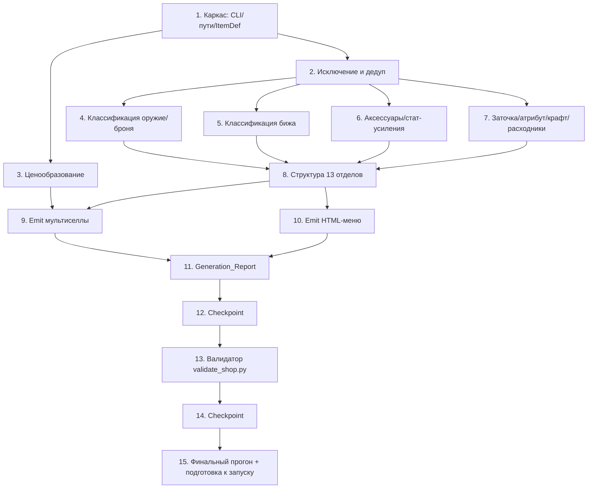

# Implementation Plan — Alt+B Shop Overhaul (Магазин за адену)

## Overview

Переработка выполняется целиком в `tools/shopgen.py` (генератор) и новом `tools/validate_shop.py`
(валидатор), а также в порождаемых ими данных: `server/game/data/multisell/6000XX.xml` и
`server/game/data/html/CommunityBoard/Custom/merchant/*.html`. Реализация НЕ требует пересборки jar —
применение выполняется рестартом сервера.

План строится инкрементально: сначала слой доступа к данным и CLI-пути активного сервера (устраняем
ключевые расхождения), затем чистые слои классификации/исключения/дедупа/цены, затем emit multisell/HTML
и отчёт, затем валидатор и property-based тесты (hypothesis), и в конце — прогон на `server/game/data`,
валидация вывода и подготовка к запуску сервера для проверки владельцем.

Язык реализации — **Python 3** (стандартная библиотека для генератора; `hypothesis` для property-тестов),
как задано в дизайне. Дизайн содержит раздел Correctness Properties (13 свойств), поэтому включены
property-based тесты — по одному на каждое свойство, с тегом `# Feature: alt-b-shop-overhaul, Property N: ...`.

## Tasks

- [x] 1. Каркас генератора: CLI, пути активного сервера, модель ItemDef
  - [x] 1.1 Ввести CLI и пути к данным активного сервера
    - Заменить хардкод `BASE = mobius-src/...` на разрешение путей от `--data-dir` (по умолчанию `server/game/data`); поддержать флаги `--dry-run` и `--report`
    - Проверять доступность каталогов `multisell` и `html/CommunityBoard/Custom/merchant`; при недоступности для записи прекращать генерацию с явной ошибкой записи
    - _Requirements: 19.1, 19.3, 19.5, 19.6_

  - [x] 1.2 Реализовать `parse_items(items_dir) -> dict[int, ItemDef]`
    - Расширить парсер: извлекать `id`, `name`, `additionalName`, `type`, `crystal_type`(grade), `bodypart`, `armor_type`, `price`(NPC_Sell_Price)
    - Некорректные/неполные блоки пропускать и собирать причину для `skipped_items`
    - _Requirements: 18.1, 18.2, 18.3_

  - [x]* 1.3 Property-тест: товар опирается на реальный предмет
    - **Property 3: Каждый товар опирается на реальный предмет** — для любой позиции `production id` есть в Item_Catalog, а имя/грейд/цена соответствуют определению
    - Тег: `# Feature: alt-b-shop-overhaul, Property 3`
    - _Requirements: 18.1, 18.2_

- [x] 2. Слой исключения (Excluded_Marker) и дедупликации
  - [x] 2.1 Реализовать `is_excluded(item, category_key) -> bool`
    - Маркеры (регистронезависимо): appearance, coupon/voucher, box/pack/bundle, fragment/piece/shard, event/test/not-in-use/NW; для базовой брони дополнительно bloody/ultimate/transcendent/bound
    - _Requirements: 2.4, 3.5, 4.4, 5.5, 6.4, 7.3, 8.3, 10.3, 11.4, 12.5, 13.4, 14.4, 20.5_

  - [x] 2.2 Реализовать `dedup(items)` по ключу `(name, crystal_type)` → минимальный `id`
    - Для браслетов/талисманов/шапок ключ дедупа — `name`; дедуп выполняется ПОСЛЕ исключения
    - _Requirements: 2.5, 3.6, 4.5, 7.4, 8.4, 10.4_

  - [x]* 2.3 Property-тест: исключение помеченных предметов
    - **Property 5: Исключение помеченных предметов** — ни одна позиция вывода не содержит Excluded_Marker в `name`/`additionalName`
    - Тег: `# Feature: alt-b-shop-overhaul, Property 5`
    - _Requirements: 2.4, 3.5, 4.4, 5.5, 6.4, 8.3, 10.3, 11.4, 12.5, 13.4, 14.4, 20.5_

  - [x]* 2.4 Property-тест: дедупликация по имени и грейду
    - **Property 4: Дедупликация по имени и грейду** — внутри категории нет двух позиций с одинаковой `(name, crystal_type)` (для браслетов/талисманов/шапок — `name`), сохраняется минимальный `id`
    - Тег: `# Feature: alt-b-shop-overhaul, Property 4`
    - _Requirements: 2.5, 3.6, 4.5, 7.4, 8.4, 10.4_

- [x] 3. Слой ценообразования (анти-эксплойт)
  - [x] 3.1 Реализовать `buy_price(item, category_rules) -> int`
    - Формула-заглушка: `base = max(price, GRADE_FLOOR[grade])`; `raw = ceil(base * MARKUP[category])`; `price = max(raw, item.price + MIN_DELTA)`; единственная валюта — адена id 57
    - При `price` неизвестном/0 применять неотрицательный `GRADE_FLOOR`; при невозможности назначить цену > NPC_Sell_Price — исключать позицию и фиксировать нарушение
    - Только формула-заглушка: точный балансовый проход по конкретным ценам вне scope
    - _Requirements: 15.1, 15.2, 15.3, 15.4, 20.1_

  - [x]* 3.2 Property-тест: анти-эксплойт цены покупки
    - **Property 1: Анти-эксплойт цены покупки** — для любой позиции вывода `buy_price > NPC_Sell_Price`; позиций, где это невозможно, в выводе нет
    - Тег: `# Feature: alt-b-shop-overhaul, Property 1`
    - _Requirements: 15.1, 15.4_

  - [x]* 3.3 Unit-тесты edge-cases цены
    - `price` = 0 / отсутствует / близко к максимуму int; проверка неотрицательности и строгого превышения
    - _Requirements: 15.2_

- [x] 4. Слой классификации: оружие и броня по грейдам
  - [x] 4.1 Реализовать классификацию оружия по грейдам и типам
    - `type == Weapon`, `bodypart ∈ {rhand,lrhand}`; тип по `weapon_type` (SWORD..ANCIENTSWORD, кроме FISHINGROD/ETC); категория по грейду {D,C,B,A,S,S80,R,R95,R99}; представитель на (грейд,тип) — минимальный id (каноничная линейка); эндгейм-линейки R/R95/R99 включены
    - _Requirements: 2.1, 2.2, 2.3_

  - [x] 4.2 Реализовать классификацию брони по грейдам, слотам и типам
    - `type == Armor`, `bodypart ∈ {chest,legs,feet,gloves,head,alldress,onepiece}`; под-тип armor_type (heavy/light/robe) в ключе представителя; категория по грейду; дедуп (name,grade); эндгейм R/R95/R99 включены
    - _Requirements: 3.1, 3.2, 3.3, 3.4_

  - [ ]* 4.3 Unit-тесты классификации оружия/брони
    - Примеры отнесения по грейду/типу/слоту, включая эндгейм-линейки (частично покрыто property-тестами и ручной сверкой вывода)
    - _Requirements: 2.1, 2.2, 3.1, 3.2, 3.3_

- [x] 5. Слой классификации: бижутерия (обычная, эпик, броши/камни)
  - [x] 5.1 Классификация обычной бижутерии по грейдам
    - `type == Armor`, `bodypart ∈ {neck, rear;lear, rfinger;lfinger}`, НЕ эпик; категории по грейдам {A,S,S80,R,R95,R99}
    - _Requirements: 4.1, 4.2, 4.3_

  - [x] 5.2 Классификация эпик-бижутерии в обособленную категорию
    - Распознавание по боссам {Queen Ant, Orfen, Core, Zaken, Baium, Antharas, Frintezza, Valakas} (паттерны имён в bodypart бижутерии); ровно одна категория `jewel_epic`
    - _Requirements: 5.1, 5.2, 5.3_

  - [x] 5.3 Классификация брошей и камней брошей
    - `bodypart ∈ {brooch, brooch_jewel}`; сама Brooch + семейства {Ruby,Sapphire,Emerald,Diamond,Opal,Obsidian,Pearl,Vital Spirit,Cat's Eye,Garnet,Tanzanite,Aquamarine}, все уровни/Greater
    - _Requirements: 6.1, 6.2, 6.3_

  - [x]* 5.4 Property-тест: обособленность эпик-бижи
    - **Property 10: Обособленность эпик-бижи** — множества `id` обычной и эпик-бижи не пересекаются
    - Тег: `# Feature: alt-b-shop-overhaul, Property 10`
    - _Requirements: 5.1, 4.4_

- [x] 6. Слой классификации: аксессуары и стат-усиления
  - [x] 6.1 Классификация браслетов и bracelet-jewels
    - `bodypart ∈ {rbracelet, lbracelet}`; курируемые стат-семейства (Dimensional Bracelet, Bracelet of the Conqueror, Eternal/Immortal/Giant's Bracelet); косметические агатионы исключены и зафиксированы в отчёте
    - _Requirements: 7.1, 7.2_

  - [x] 6.2 Классификация талисманов
    - `bodypart == deco1` (слот талисмана в Mobius); курируемые стат-семейства (Mysterious/графированные Talisman (R*-grade), цветные талисманы)
    - _Requirements: 8.1, 8.2_

  - [x] 6.3 Классификация красок (dyes) со статами
    - 6 характеристик {STR,DEX,CON,INT,WIT,MEN}; легендарные стат-краски всех доступных уровней; декоративные/безстатовые исключаются
    - _Requirements: 9.1, 9.2, 9.3, 9.4_

  - [x] 6.4 Классификация стат-шапок
    - Классические стат-шапки (+1 к характеристике) по справочному whitelist id (Teddy Bear/Piggy/Jester/Wizard/Dapper Cap/Romantic Chapeau/Iron Circlet/Archangel Circlet); appearance/безстатовые исключаются
    - _Requirements: 10.1, 10.2_

  - [x] 6.5 Классификация плащей, поясов и агатионов
    - Плащи `bodypart == back` (R/R95/R99), пояса `bodypart == waist` (R/R95/R99); стат-агатионы в данных Mobius не имеют надёжного стат-сигнала → категория не создаётся и фиксируется в отчёте (needs_curation)
    - _Requirements: 11.1, 11.2, 11.3_

  - [x]* 6.6 Property-тест: полнота по характеристикам и стихиям
    - **Property 11: Полнота по характеристикам и стихиям** — для каждой характеристики/стихии: если предмет есть в каталоге, он в выводе; иначе отсутствие в Generation_Report
    - Тег: `# Feature: alt-b-shop-overhaul, Property 11`
    - _Requirements: 9.2, 9.5, 13.2, 13.5_

- [x] 7. Слой классификации: заточка/аугментация, атрибут, крафт/квесты, расходники
  - [x] 7.1 Классификация заточки, камней жизни и аугментации
    - Категории свитков заточки оружия/брони (обычные+благословенные), Life_Stone (высшие уровни + Giants' Power)
    - _Requirements: 12.1, 12.2, 12.3_

  - [x] 7.2 Классификация расходников/зарядов
    - Soulshot/Spiritshot/Blessed Spiritshot R-грейда; зелья/эликсиры актуального грейда
    - _Requirements: 12.4, 16.1_

  - [x] 7.3 Классификация атрибутных камней/кристаллов
    - 6 стихий {Fire,Water,Wind,Earth,Holy,Dark} (Stone/Crystal); недостающие стихии фиксируются в отчёте
    - _Requirements: 13.1, 13.2, 13.3_

  - [x] 7.4 Классификация крафта, материалов, рецептов, кристаллов и квест-предметов
    - Рецепты эндгейм-экипа (Twilight/Seraph/Eternal/Apocalypse/Specter/Amaranthine), кристаллы по грейдам, соул-кристаллы (квест); материалы РБ требуют ручной курации (зафиксировано в отчёте); хлам (удочки FISHINGROD/ETC) исключён
    - _Requirements: 14.1, 14.2, 14.3, 14.4, 20.5_

  - [ ]* 7.5 Unit-тесты правил классификации стат/крафт-категорий
    - Примеры для дизайн-паттернов имён (краски, шапки, рецепты, атрибут-стихии) — частично покрыто property-тестами
    - _Requirements: 9.4, 10.3, 13.3, 14.4_

- [x] 8. Единая структура 13 отделов и карта категория→отдел→multisell-id
  - [x] 8.1 Определить структуру 13 отделов и карту категорий
    - 13 отделов; декадные диапазоны multisell-id 600001–600099; отделы Петы/Клан/Косметика + сервисы Фазы 2 — видимые заглушки; отображение категория→отдел функционально
    - _Requirements: 1.1, 1.7, 1.9, 20.3_

  - [x]* 8.2 Property-тест: категория принадлежит ровно одному отделу
    - **Property 7: Категория принадлежит ровно одному отделу** — отображение категория→отдел функционально
    - Тег: `# Feature: alt-b-shop-overhaul, Property 7`
    - _Requirements: 1.7_

- [x] 9. Emit-слой: мультиселлы
  - [x] 9.1 Реализовать `write_multisell(msid, entries)`
    - Писать `multisell/{msid}.xml` с блоком `<npcs><npc>-1</npc></npcs>`, ingredient `id="57"` (адена) и production `id`/`count`; комментарий с `name`; пустую категорию не создавать; чистка устаревших 6000XX (в т.ч. в custom/)
    - _Requirements: 19.1, 19.2, 15.3, 2.6_

  - [x]* 9.2 Property-тест: единственная валюта — адена
    - **Property 2: Единственная валюта — адена** — каждый ingredient имеет `id == 57`
    - Тег: `# Feature: alt-b-shop-overhaul, Property 2`
    - _Requirements: 15.3_

  - [x]* 9.3 Property-тест: мультиселл вызывается без NPC
    - **Property 6: Каждый мультиселл вызывается без NPC** — ровно один блок `<npcs><npc>-1</npc></npcs>`
    - Тег: `# Feature: alt-b-shop-overhaul, Property 6`
    - _Requirements: 19.2_

- [x] 10. Emit-слой: HTML-меню магазина
  - [x] 10.1 Реализовать `build_html(structure)`
    - `main.html` (13 отделов + видимые заглушки Фазы 2) и по странице на отдел; кнопки категорий → `_bbsmultisell;{msid},merchant/{dept}`; ровно одна кнопка «◄ В отделы» на странице отдела; возврат к родительскому отделу для категорий; ≤ 2 клика; чистка устаревших страниц
    - _Requirements: 1.2, 1.3, 1.4, 1.5, 1.6, 19.3_

  - [x] 10.2 Сохранить существующие разделы корневой навигации
    - Страницы используют `%navigation%` (navigation.html не трогается): Баффер/Телепорт/Поиск дропа/Понижение уровня/Премиум остаются в корне и ведут на прежние целевые страницы
    - _Requirements: 1.8_

  - [x]* 10.3 Property-тест: двух-кликовая достижимость
    - **Property 8: Двух-кликовая достижимость** — для каждой категории есть путь корень→отдел→категория
    - Тег: `# Feature: alt-b-shop-overhaul, Property 8`
    - _Requirements: 1.6, 1.2, 1.3_

  - [x]* 10.4 Property-тест: единственная кнопка возврата к отделам
    - **Property 9: Единственная кнопка возврата к отделам** — ровно одна кнопка «◄ В отделы» на странице отдела; категория возвращается к родительскому отделу
    - Тег: `# Feature: alt-b-shop-overhaul, Property 9`
    - _Requirements: 1.4, 1.5_

  - [x]* 10.5 Unit/snapshot-тесты корневой страницы
    - `main.html` содержит ровно 13 отделов + видимые заглушки Фазы 2 (test_structure_has_13_departments)
    - _Requirements: 1.1, 1.9_

- [x] 11. Generation_Report
  - [x] 11.1 Реализовать `emit_report(report)`
    - Агрегировать: `per_category`, `total_items`, `skipped_items`, `empty_categories`, `missing_families` (боссы/камни/стихии/характеристики/needs_curation), `anti_exploit_violations`, `l2scripts_gap`
    - _Requirements: 5.6, 6.5, 9.5, 11.5, 13.5, 14.5, 15.4, 17.4, 18.3, 18.4, 18.5_

  - [x]* 11.2 Property-тест: пустые категории не создаются и фиксируются
    - **Property 12: Пустые категории не создаются и фиксируются**
    - Тег: `# Feature: alt-b-shop-overhaul, Property 12`
    - _Requirements: 2.6, 5.6, 11.5, 14.5, 18.5, 17.4_

  - [x]* 11.3 Property-тест: согласованность отчёта покрытия
    - **Property 13: Согласованность отчёта покрытия** — сумма счётчиков = `total_items` = фактическому числу строк `<item>`
    - Тег: `# Feature: alt-b-shop-overhaul, Property 13`
    - _Requirements: 18.4, 18.3_

- [x] 12. Checkpoint — генератор собран, прогнать все тесты
  - Все тесты (17 passed, 1 skipped под root) проходят.

- [x] 13. Валидатор вывода `tools/validate_shop.py`
  - [x] 13.1 Реализовать XSD- и структурную валидацию мультиселлов
    - Каждый созданный `6000XX.xml`: well-formed + валидация против `xsd/multisell.xsd` (xmllint); наличие `<npcs><npc>-1</npc></npcs>` и `ingredient id="57"`; проверка дублей id между `multisell/` и `multisell/custom/`
    - _Requirements: 19.2, 15.3, 19.4_

  - [x] 13.2 Реализовать резолвинг id и проверку ссылок HTML
    - Каждый `production id` резолвится в Item_Catalog; кнопки HTML указывают на существующие `merchant/*.html` или `_bbsmultisell;{msid}` созданных категорий; вывод содержит только `.xml`/`.html`
    - _Requirements: 18.1, 1.4, 1.5, 19.4_

  - [x] 13.3 Реализовать сверку с эталоном L2Scripts и хроникой
    - Крупные классы предметов (оружие/броня по грейдам, бижа, эпик, броши, браслеты, талисманы, краски, шапки, плащи, пояса, заточка, атрибут, заряды, камни жизни) сверяются с покрытием; расхождения → `l2scripts_gap` (пуст)
    - _Requirements: 16.1, 16.2, 16.3, 16.4, 17.1, 17.2, 17.3_

  - [x]* 13.4 Unit-тест: недоступный на запись каталог
    - Прекращение генерации с ошибкой записи при недоступном `multisell`/`merchant` (пропускается под root)
    - _Requirements: 19.6_

- [x] 14. Checkpoint — валидатор готов, прогнать все тесты
  - Все тесты проходят; валидация вывода пройдена без ошибок.

- [x] 15. Финальный прогон на активном сервере и подготовка к запуску
  - [x] 15.1 Прогнать генератор на `server/game/data` и провалидировать вывод
    - dry-run → полная генерация → `validate_shop.py`; `l2scripts_gap` пуст; вывод — только данные (без `.java`/`.class`), применение рестартом без пересборки jar; инструкция запуска сервера предоставлена владельцу
    - _Requirements: 19.4, 19.5, 16.1, 16.4, 18.4_

## Task Dependency Graph

## Notes

- Задачи с `*` — опциональные (тесты); реализованы 13 property-тестов (по одному на каждое свойство дизайна) + unit-тесты цены/дедупа/исключений/структуры/ошибки записи.
- Каждая задача ссылается на конкретные подтребования (Requirements X.Y) и/или свойства (Property N) для трассируемости.
- Вне scope (не включено намеренно): Java-сервисы Фазы 2 (профессии/топы/Герой), ослабление эпик-боссов, точный балансовый проход по конкретным ценам — задаётся только формула-заглушка (Requirement 20.1, 20.2).
- Пересборка jar не требуется — применение ассортимента выполняется рестартом сервера (Requirement 19.4); запуск сервера для проверки в игре выполняет владелец вручную.
- Примечания по данным Mobius: талисманы используют слот `deco1`; стат-агатионы и крафт-материалы РБ не имеют надёжного автосигнала и вынесены в `needs_curation` отчёта (ручная курация в отдельном проходе).
