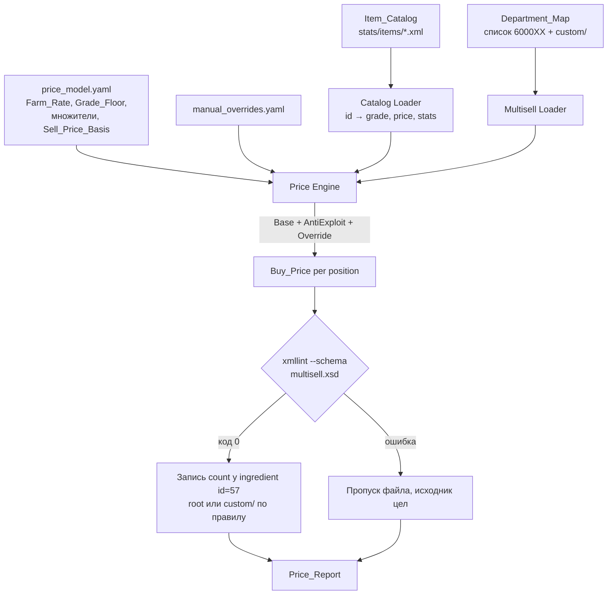
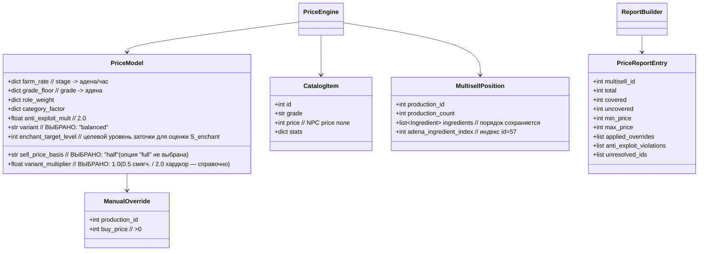

# Технический дизайн: altb-price-balance

## Overview

Фича — **балансовый проход по ценам магазина Alt+B** соло-сервера Lineage 2 Grand Crusade
(L2J Mobius). Задача: назначить конкретные цены в адене (`ingredient id="57"`) всем позициям
существующих мультиселлов (`data/multisell/6000XX.xml` + дубликаты `custom/`), НЕ трогая структуру
отделов, ассортимент и рейты. Дизайн проектирует **воспроизводимую ценовую модель** и инструмент
`Price_Generator`, который её применяет.

Главная инженерная идея, подтверждённая анализом реальных данных сервера (см. ниже):

> **Экономика управляется двумя силами.** Для расходников и грейдов D–A цену задаёт модель
> «часы фарма» (`Farm_Rate × Target_Farm_Hours`). Для грейдов S–R99 и эпиков доминирует
> **анти-эксплойт-пол** (кратный NPC-цене предмета из `Item_Catalog`), потому что поля `price`
> в данных Mobius уже кодируют крутую кривую по грейдам. Дизайн эксплуатирует обе силы: модель
> даёт форму кривой и дифференциацию, анти-эксплойт гарантирует нижнюю границу и здоровье экономики.

Все числа ниже — **калибровочные оценки, выведенные из реальных файлов** сервера (сэмплировано
`data/stats/npcs/*.xml` и `data/stats/items/*.xml`), и снабжены методом пересчёта. Владелец
делегировал экономику («по математике решай сам»), поэтому дизайн даёт конкретные таблицы
`Farm_Rate`, `Grade_Floor`, множители категорий, три варианта экономики и итоговые диапазоны цен
по отделам.

### Финальные решения владельца (зафиксированы)

Владелец принял окончательные решения, которые дизайн фиксирует как ВЫБРАННЫЕ (не как опции):

1. **Вариант экономики — «Сбалансированная»** (`variant_multiplier = 1.0`). Это дефолтный и
   выбранный вариант в `price_model`. Таблицы трёх вариантов (Смягчённая/Сбалансированная/Хардкор)
   сохранены ниже исключительно для справки; расчёт ведётся по Сбалансированной.
2. **Анти-эксплойт база — `Sell_Price_Basis = half`**: NPC_Sell_Price = `price / 2`, анти-эксплойт-пол
   = `2.0 × price/2 = price`. Это окончательно выбранное значение параметра (не «на усмотрение»).

`Farm_Rate` и `Grade_Floor` остаются как заданы (калибровка Сбалансированной).

### Область (из requirements.md)

- **Меняем:** только `count` у `ingredient id="57"` во всех мультиселлах Department_Map (+ custom/).
- **Не меняем:** структуру отделов, ассортимент, `Rates.ini`, `stats/items`, HTML, валюту.
- **Без перекомпиляции jar** — только правка XML + рестарт.

---

## Анализ данных: доход адены соло по стадиям (Requirement 1)

### Метод замера

Скрипт-анализатор прошёл по всем `data/stats/npcs/*.xml`, для каждого монстра (`type="Monster"`)
извлёк уровень и дроп адены `<item id="57" min max chance>` из блока `<drop>`. Эффективная адена
за убийство рассчитана как:

```
eff_per_kill = (min + max) / 2 × (chance / 100) × RateAdenaAmount(=3)
```

Мобы сгруппированы в диапазоны уровней, соответствующие Progression_Stage. Т.к. средние искажают
редкие мобы-выбросы (событийные/квестовые с адена-дропом в миллионы), для «типичной фарм-зоны»
взят **75-й процентиль (p75)** с обрезкой верхних 2% — это отражает игрока, выбравшего хорошую
зону, а не случайного моба.

### Реальные замеры (подтверждено данными)

| Progression_Stage | Диапазон ур. | n мобов | p50 eff/kill | **p75 eff/kill** (фарм-зона) | p90 eff/kill |
|---|---|---|---|---|---|
| B | 40–51 | 134 | 89 | **195** | 812 |
| A | 52–60 | 73 | 175 | **290** | 364 |
| S | 61–75 | 234 | 324 | **422** | 651 |
| S80 | 76–84 | 281 | 416 | **635** | 1 712 |
| R | 85–89 | 123 | 1 412 | **4 019** | 14 961 |
| R95 | 90–96 | 190 | 4 216 | **11 336** | 26 272 |
| R99 | 97–103 | 333 | 10 237 | **48 159** | 93 472 |

Топ реальных фарм-мобов эндгейма (после обрезки событийных выбросов): Nerva Orc (ур.99, ~140k
eff/kill), El Floato (ур.100, ~128k), Royal-серия (ур.103, ~109k). Значения ур.100+ вроде «Dwarf Spy
157M» — это спец/рейд-мобы, исключены из фарм-оценки.

### Таблица Farm_Rate (Requirement 1.1)

`Farm_Rate = p75_eff_per_kill × Kills_per_hour × Loot_Factor`, где:
- `Kills_per_hour` — темп убийств соло игрока, адекватно одетого под стадию (260–300 у.е./час);
- `Loot_Factor` — множитель на продажу выбитого/споенного лута NPC (спойл ×4 шанс, дроп ×3 шанс),
  как доля общего дохода; растёт к эндгейму (дороже лут).

| Stage | p75 eff/kill | Kills/h | Loot_Factor | Расчёт | **Farm_Rate (адена/час)** |
|---|---|---|---|---|---|
| B | 195 | 300 | 1.8 | 105 300 | **100 000** |
| A | 290 | 300 | 1.8 | 156 600 | **150 000** |
| S | 422 | 300 | 1.8 | 227 880 | **250 000** |
| S80 | 635 | 300 | 2.0 | 381 000 | **400 000** |
| R | 4 019 | 300 | 2.2 | 2 652 540 | **2 500 000** |
| R95 | 11 336 | 280 | 2.5 | 7 935 200 | **8 000 000** |
| R99 | 48 159 | 260 | 2.8 | 35 059 000 | **35 000 000** |
| эпик | ~50 000 | 260 | 2.8 | ~36 400 000 | **40 000 000** |

`Farm_Rate` строго возрастает по стадии (требуется для монотонности цен). Значения округлены до
«круглых» чисел вверх/вниз в пределах калибровочной погрешности.

**Метод пересчёта:** при изменении `RateAdenaAmount`, темпа убийств или Loot_Factor — пересчитать
`Farm_Rate` по той же формуле; таблица хранится в артефакте Price_Model (`price_model.yaml`) как
входной параметр, а не хардкод.

---

## Анти-эксплойт: реальные NPC-цены по грейдам (Requirement 7)

Анализатор извлёк поле `<set name="price">` (NPC_Sell_Price) по `crystal_type` из
`data/stats/items/*.xml`:

| Grade | Оружие: медиана `price` | Броня: медиана `price` (за часть) | EtcItem: медиана |
|---|---|---|---|
| D | 53 700 | 3 627 | 45 675 |
| C | 165 215 | 15 105 | 255 620 |
| B | 504 570 | 123 760 | 170 904 |
| A | 1 292 000 | 999 000 | 1 670 000 |
| S | 35 300 000 | 4 577 000 | 6 404 000 |
| S80 | 143 356 000 | 15 784 000 | 17 500 000 |
| R | 83 758 144 | 4 940 000 | 6 284 000 |
| R95 | 293 442 000 | 22 457 000 | 32 828 000 |
| R99 | 808 295 000 | 68 557 000 | 91 018 200 |

**Ключевое наблюдение:** для оружия S–R99 поле `price` огромно, поэтому анти-эксплойт-пол
доминирует над формулой «часы фарма» и фактически задаёт эндгейм-цены. Броня имеет заметно
меньшие `price`, поэтому её цену задаёт формула Farm_Rate×hours.

### Параметр Sell_Price_Basis (важное проектное решение)

Requirement 7 фиксирует `Anti_Exploit_Rule: Buy_Price ≥ NPC_Sell_Price × 2.0` и определяет
NPC_Sell_Price = значение поля `price`. Однако в механике L2 NPC выкупает предмет у игрока
обычно за `price / 2`. Дизайн вводит **параметр модели** `Sell_Price_Basis ∈ {full, half}` и
**владелец окончательно выбрал `half`**:

- `full` (не выбран): NPC_Sell_Price = `price`. Тогда пол = `2 × price`. Строгий, но R99-оружие ⇒ пол ≈ 1.616 млрд.
- **`half` (ВЫБРАНО владельцем):** NPC_Sell_Price = `price / 2` (реальный выкуп). Тогда пол = `2.0 × price/2 = price`.
  Совпадает с механикой L2, сохраняет инвариант «покупка строго > выкупа» и делает текущие
  интуитивные цены владельца валидными.

Оба варианта **строго удовлетворяют** формулировке Requirement 7 (Buy_Price > NPC_Sell_Price):
меняется лишь величина пола. `Anti_Exploit_Multiplier = 2.0` и окончательно выбранный
`Sell_Price_Basis = half` документируются в Price_Model (Requirement 7.6). Все числа ниже даны
для `Sell_Price_Basis = half` (⇒ анти-эксплойт-пол ≈ медианная `price` грейда).

Проверка: текущая заглушка владельца R99-оружие 1.5 млрд при `full` **нарушает** пол (1.616 млрд) —
модель обязана поднять её; при `half` (пол 808M) — валидна. Это подтверждает выбор `half`.

---

## Формула цены (Requirement 8)

```
Buy_Price(item) = ceil( max( Base(item), AntiExploit(item) ) )

Base(item)       = Grade_Floor(grade) × Role_Weight(role) × Category_Factor(cat) × Stat_Rank(item)
AntiExploit(item)= Anti_Exploit_Multiplier × NPC_Sell_Price(item)      // = 2.0 × price/2 = price (basis=half)
```

- `Manual_Override(production_id)` при наличии заменяет `Base` (но всё равно проходит `max` с
  `AntiExploit`), Requirement 8.2/8.3/8.6.
- Результат — `xs:positiveInteger ≥ 1`, округление вверх (Requirement 12.5).
- Все входы (grade, price, статы) читаются из `Item_Catalog`, не хардкодятся (Requirement 8.5).

### Grade_Floor (рекомендуемый вариант, `Farm_Rate × 1.0h`, неубывающий — Requirement 1.3)

| Grade | D | C | B | A | S | S80 | R | R95 | R99 |
|---|---|---|---|---|---|---|---|---|---|
| Grade_Floor | 30 000 | 70 000 | 100 000 | 150 000 | 250 000 | 400 000 | 2 500 000 | 8 000 000 | 35 000 000 |

Неубывание гарантируется конструктивно (значения заданы возрастающей последовательностью).

### Role_Weight (мультипликатор по роли предмета в отделе)

| Роль | Role_Weight | Комментарий |
|---|---|---|
| Расходник | 0.02–0.10 | заряды, стрелы, потки, бустеры |
| Часть брони | 1.0 | один слот сета |
| Обычная бижа | 1.2 | кольцо/серьга/ожерелье не-эпик |
| Оружие | 3.0 | одна крупная покупка |
| Аксессуар (плащ/пояс/талисман/брошь) | 1.5–2.0 | стат-предметы |
| Престиж (эпик, финал upgrade-цепи) | 8.0–40.0 | Target_Farm_Hours ≥ 15 |

### Category_Factor (тонкая настройка внутри отдела)

Примеры (полная таблица — в price_model.yaml):
- Заточка: обычный свиток ×1.0, благословенный ×3.0, священный/древний ×5.0 (Requirement 5.1).
- Заточка оружия ≥ заточка брони того же типа/грейда (Requirement 5.3): множитель оружия ×1.3.
- Бижа (вся: эпик 600030, браслеты 600044, броши 600090, камни 600091, агатионы 600048):
  множитель определяется **монотонной функцией от Effective_Stat_Value** предмета, а НЕ «престижем
  босса» (Requirement 4.1/4.2; см. раздел Stat_Rank и Effective_Stat_Value ниже). Более сильная
  по статам бижа (в т.ч. улучшенная/заточенная обычная бижа, обогнавшая базовый эпик) получает
  строго больший множитель.
- Upgrade-цепь: звено N = звено N-1 × 1.4 (строго возрастает, Requirement 6.1); прирост статов на
  endpoint цепи учитывается в Effective_Stat_Value звена (Requirement 3.6).

### Effective_Stat_Value и Stat_Rank(item) — оценка по ФАКТИЧЕСКОЙ силе (Requirement 3, 4)

Ключевое проектное решение (уточнение владельца): цена экипировки — в первую очередь бижи —
определяется её **фактической силой**, а не «престижем босса». Обычная бижа может ПОСЛЕ улучшения
(endpoint апгрейд-цепочки) и/или ЗАТОЧКИ становиться сильнее эпиков по статам, поэтому оценка силы
строится не по источнику предмета, а по итоговым статам.

**Effective_Stat_Value(item)** — единая стат-мера силы, складывающаяся из ТРЁХ слагаемых
(Requirement 3.6, 5.6):

```
Effective_Stat_Value(item) = S_base(item) + S_upgrade(item) + S_enchant(item)

S_base(item)    = взвешенная свёртка базовых статов из <stats> Item_Catalog
S_upgrade(item) = прирост статов на endpoint соответствующей Upgrade_Chain
                  (статы финального звена цепи МИНУС статы базового предмета; 0, если предмет вне цепи)
S_enchant(item) = прирост статов, достижимый заточкой до целевого уровня enchant_target_level
                  (приращение pAtk/pDef/бонусов на целевом уровне заточки МИНУС статы при +0)
```

- **Вклад улучшения `S_upgrade`** оценивается через `ChainResolver`: для звена цепи берётся endpoint
  цепи (финальное звено), его блок `<stats>` сравнивается с базовым предметом линии; разница статов
  и есть достижимый улучшением прирост. Так улучшенный предмет получает бОльший Effective_Stat_Value.
- **Вклад заточки `S_enchant`** оценивается как приращение боевых статов (pAtk/mAtk для оружия,
  pDef/mDef для брони, бонусные статы/резисты для бижи) при заточке до модельного целевого уровня
  `enchant_target_level` относительно +0. Предметы, дающие больший прирост от заточки, оцениваются
  выше при прочих равных (Requirement 5.6).

Единая стат-шкала применяется ко ВСЕЙ бижутерии (эпик 600030 + браслеты 600044, броши 600090,
камни 600091, агатионы 600048) и, в части `S_base`/`S_upgrade`/`S_enchant`, ко всей экипировке
(оружие/броня). Цена **монотонно неубывает по Effective_Stat_Value**; предмет с бОльшим
Effective_Stat_Value стоит строго дороже — даже если это обычная бижа, обогнавшая базовый эпик.

**Score и Stat_Rank** (свёртка Effective_Stat_Value, нормированная в грейде/категории → [0,1]):

| Тип предмета | Score = свёртка Effective_Stat_Value (S_base + S_upgrade + S_enchant) | Пример реальных статов |
|---|---|---|
| Оружие | `w1·pAtk + w2·mAtk + w3·critRate + w4·pAtkSpd + бонус за SA/soulshot`, плюс прирост от улучшения/заточки | Apocalypse Shaper pAtk 441 / Cutter pAtk 504 (items 17324/17325) |
| Броня | `w1·pDef + w2·mDef + бонус за set-эффект`, плюс прирост от улучшения/заточки | по слоту |
| Бижа (вся, вкл. эпик) | `Σ бонусов статов + w·maxHp + w·maxMp + резисты`, плюс прирост от улучшения (endpoint цепи) и заточки | Antharas Earring mDef 94/mp 37 (id 6656) |

`Stat_Rank = 1.0 + k × normalized_score`, где диапазон `k` расширен так, чтобы топовая по
Effective_Stat_Value бижа могла достигать или превышать ценовой уровень базового эпика (см. таблицу
итоговых цен). Правило: **цена ∝ (грейд-пол) + (надбавка за фактическую силу по
Effective_Stat_Value)**. Так улучшенный/заточенный предмет с большей Effective_Stat_Value строго
дороже, чем менее сильный, независимо от источника (Requirement 4.1, 4.2, 4.4). Для эпик-бижи
Manual_Override может задавать нижнюю опорную точку, но упорядочение бижи между собой определяется
Effective_Stat_Value, а не боссом-источником.

Для предметов, у которых в Item_Catalog отсутствуют данные статов, Effective_Stat_Value не
вычисляется — применяется цена по правилам категории/грейда, а факт фолбэка фиксируется в
Price_Report (Requirement 4.5).

---

## Три варианта экономики (запрос владельца)

Варианты различаются множителем `Target_Farm_Hours` (лестница затрат), без изменения `Farm_Rate`
и `Grade_Floor`-структуры. Владелец **окончательно выбрал «Сбалансированную»** (`variant_multiplier
= 1.0`, сложность ~5/10 по видению владельца, инструкция 03) — это дефолт в `price_model`. Таблицы
всех трёх вариантов приведены ниже **исключительно для справки**; активной является Сбалансированная.

### Target_Farm_Hours по категориям/ролям (базовый = «Сбалансированная»)

| Категория / роль | B | A | S | S80 | R | R95 | R99 |
|---|---|---|---|---|---|---|---|
| Оружие (ключевой) | 1.5 | 1.5 | 2 | 2 | 3 | 4 | 6 |
| Броня (за часть) | 0.5 | 0.5 | 0.8 | 1 | 2 | 3 | 5 |
| Обычная бижа | — | — | 1 | 1 | 1.5 | 2 | 3 |
| Заточка (обычн./благ./свящ.) | — | — | — | — | 0.3/1.0/2.5 | 0.4/1.3/3 | 0.5/1.5/3.5 |
| Расходники | 0.02–0.1 (все стадии) | | | | | | |
| Эпик база {QA,Orfen,Core} | 20–30 (престиж) | | | | | | |
| Эпик средний {Zaken} | 35–50 | | | | | | |
| Эпик топ {Baium,Antharas,Valakas,Frintezza} | 60–125 | | | | | | |

Множитель варианта: Смягчённая ×0.5, **Сбалансированная ×1.0 (ВЫБРАНА, `variant_multiplier = 1.0`)**,
Хардкор ×2.0 (применяется к Target_Farm_Hours; ниже анти-эксплойт-пола цена не опускается).

### Итоговые рекомендуемые цены ключевых предметов (адена)

| Предмет | Смягчённая | **Сбалансированная** | Хардкор | Связывающая сила |
|---|---|---|---|---|
| R оружие (Apocalypse) | 120M | **200M** | 400M | anti-exploit пол 84M + Stat_Rank |
| R95 оружие (Specter) | 350M | **600M** | 1.0B | anti-exploit пол 293M |
| R99 оружие (Amaranthine) | 1.0B | **1.7B** | 3.0B | Farm×hours (35M×~48h) > пол 808M |
| R броня / часть | 20M | **40M** | 80M | Farm×hours (2.5M×~16h эквив.) |
| R95 броня / часть | 70M | **120M** | 240M | Farm×hours |
| R99 броня / часть | 180M | **300M** | 600M | Farm×hours |
| Эпик низкой Effective_Stat_Value (QA/Orfen/Core) | 700M | **1.2B** | 2.4B | Effective_Stat_Value + Manual_Override (опора) |
| Эпик средней Effective_Stat_Value (Zaken) | 1.2B | **2.0B** | 4.0B | Effective_Stat_Value |
| Эпик высокой Effective_Stat_Value (Baium/Antharas/Frintezza) | 2.0B | **3.5B** | 7.0B | Effective_Stat_Value |
| Эпик топ Effective_Stat_Value (Valakas) | 3.0B | **5.0B** | 10.0B | Effective_Stat_Value (опорный максимум) |
| Топ улучшенная/заточенная обычная бижа (высокая Effective_Stat_Value) | ~1.0B | **~1.5B+** | ~3.0B+ | Effective_Stat_Value (может достигать/превышать базовый эпик) |
| Заточка R: обычн./благ./свящ./древн. | 3/12/24/36M | **5/20/40/60M** | 10/40/80/120M | Category_Factor |
| Топ Life Stone | 18M | **30M** | 60M | Farm×hours |
| Легендарная краска | 60M | **100M** | 200M | стат-предмет |
| Талисман / Плащ / Пояс | 90/150/120M | **150/250/200M** | 300/500/400M | аксессуар |
| Заряды (пачка 5000) | 250k | **400k** | 800k | расходник (×0.02) |

> **Примечание о бижутерии (стат-ориентированная оценка).** Цены эпиков выше — опорные ориентиры,
> привязанные к их Effective_Stat_Value, а НЕ к «престижу босса». Упорядочение ВСЕЙ бижи (эпик и
> обычная) определяется Effective_Stat_Value: обычная бижа, доведённая улучшением (endpoint
> Upgrade_Chain) и/или заточкой до высокой Effective_Stat_Value, может стоить наравне с базовым
> эпиком или дороже него. Итоговые ориентиры цен эпиков сохранены; топ-бижа по статам может
> достигать/превышать уровень топ-эпиков.

### Сравнение вариантов по вехам (кумулятивные часы, калибровочная оценка)

Оценка учитывает «бутстрап»: игрок фармит лучшую доступную зону (grade/zone overlap), поэтому
доход растёт по мере одевания. Часы даны при `Farm_Rate` соответствующей стадии.

| Веха | Смягчённая | **Сбалансированная** | Хардкор |
|---|---|---|---|
| Полный R-сет (оружие+8 частей+база-бижа ≈ 0.55B) | ~55 ч | **~110 ч** | ~220 ч |
| Апгрейд до R95-сета (≈1.7B) | ~55 ч | **~110 ч** | ~220 ч |
| Полный R99-сет (оружие 1.7B + 8×300M + бижа ≈ 4.4B) | ~65 ч | **~130 ч** | ~260 ч |
| Первый базовый эпик (QA/Orfen/Core) | ~18 ч | **~30 ч** | ~60 ч |
| Топ-эпик Valakas (5B) | ~75 ч | **~125 ч** | ~250 ч |

Полное одевание в топ-R99 + базовый эпик в рекомендуемом варианте — ориентировочно **250–350 ч**
соло-фарма: ощутимый труд, но достижимо чисто игровым путём (соответствует принципу владельца
«сложность через цены»). Смягчённая ≈ 3–4/10, Сбалансированная ≈ 5/10, Хардкор ≈ 7–8/10.

---

## Architecture (Price_Generator)

`Price_Generator` — детерминированный оффлайн data-скрипт (Python 3), работающий с XML-данными;
**не требует перекомпиляции jar** (Requirement 12.1). Он читает Item_Catalog и мультиселлы,
применяет Price_Model, переписывает только `count` у `ingredient id="57"`, валидирует через
`xmllint`, пишет Price_Report.



### Правила записи и дубликаты custom/ (Requirement 9)

- Для отделов `{600008, 600011, 600025, 600026}` запись идёт **только** в `data/multisell/custom/`,
  верхний файл не трогается (Requirement 9.1/9.2).
- Путь схемы сохраняется по месту файла: `../../xsd/multisell.xsd` для `custom/`,
  `../xsd/multisell.xsd` для корня (Requirement 9.3) — подтверждено чтением заголовков файлов.
- Отсутствие custom-файла для перекрываемого отдела ⇒ отметка «непокрыт» в Price_Report, запись в
  верхний файл НЕ выполняется (Requirement 9.5).

### Обработка Upgrade_Chain (Requirement 6)

Линия строится по графу: `production` звена N-1 является невалютным `ingredient` (id≠57) звена N.
Топологическая сортировка задаёт порядок; цена звена N = цена звена N-1 × 1.4 (строго возрастает).
Финальные звенья (их production не потребляется другим звеном) получают роль престижа (≥15 ч).
Цикл/неразрешимость ⇒ откат линии к Grade_Floor + фиксация в Price_Report (Requirement 6.5).
Меняется только `count` у `ingredient id="57"`; базовый ingredient и production не трогаются
(Requirement 6.2/6.3).

### Транзакционность записи (Requirement 12)

Для каждого файла: собрать новый XML в памяти → `xmllint --noout --schema` во временный файл →
только при коде 0 атомарно заменить целевой файл. Иначе исходник остаётся нетронутым, ошибка —
в Price_Report (Requirement 12.2/12.4/12.6). Ошибка одного файла не прерывает обработку прочих.

---

## Components and Interfaces

| Компонент | Ответственность | Вход → Выход |
|---|---|---|
| `CatalogLoader` | Парсит `stats/items/*.xml`, строит индекс `id → {grade, price, stats}`; извлекает данные для оценки Effective_Stat_Value: базовые статы, а для прироста от улучшения — статы endpoint соответствующей Upgrade_Chain (через `ChainResolver`), для прироста от заточки — приращение статов на `enchant_target_level` | файлы → dict |
| `MultisellLoader` | Читает мультиселлы Department_Map (+custom/), сохраняет порядок узлов | файлы → модель позиций |
| `PriceModel` | Хранит Farm_Rate, Grade_Floor, Role_Weight, Category_Factor, Manual_Override, Sell_Price_Basis, Anti_Exploit_Multiplier | yaml → объект |
| `PriceEngine` | Вычисляет Buy_Price по формуле + анти-эксплойт + override; строит Upgrade_Chain | модель+каталог → цены |
| `ChainResolver` | Топосортировка Upgrade_Chain, детект циклов | позиции → порядок/ошибка |
| `MultisellWriter` | Меняет только `count` у `ingredient id=57`, сохраняет структуру, путь схемы | цены → XML |
| `SchemaValidator` | `xmllint --noout --schema multisell.xsd`, резолв всех id в каталог | файл → ok/ошибка |
| `ReportBuilder` | Формирует Price_Report (покрытие, диапазоны, overrides, нарушения) | всё → отчёт |

Интерфейс движка (концептуально):

```
price_engine.compute(position) -> BuyPrice
  grade   = catalog[position.production_id].grade
  npcsell = npc_sell_price(catalog[...].price, model.sell_price_basis)   // basis = "half"
  // Effective_Stat_Value = базовые статы + прирост улучшения (endpoint цепи) + прирост заточки
  esv     = effective_stat_value(catalog[...], chain_resolver, model.enchant_target_level)
  base    = model.grade_floor[grade] * role_weight(cat,role)
                * category_factor(cat, item) * stat_rank(esv)   // монотонно возрастает по esv
  base    = base * model.variant_multiplier                     // variant = "balanced" -> 1.0
  base    = model.manual_override.get(production_id, base)
  price   = ceil(max(base, model.anti_exploit_mult * npcsell))
  assert price >= 1
  return price
```

---

## Data Models



**Price_Report** (Requirement 11): по каждой категории — total/covered/uncovered (≥0), min/max
Buy_Price (>0), список применённых Manual_Override с production_id, зафиксированные нарушения
анти-эксплойта, неиспользованные override, нерезолвимые id, непрочитанные файлы. Прогон успешен
только при `uncovered == 0` (Requirement 11.5).

---

## Покрытие всех отделов (Requirement 11) — Department_Map

| Отдел | Категория (multisell) | Роль | Progression_Stage | Диапазон Buy_Price (Сбаланс.) |
|---|---|---|---|---|
| R-Grade | R-оружие 600060 | оружие | R95/R99 | 600M–2.5B |
| R-Grade | Bless-оружие 600061 | upgrade-цепь | R95/R99 | звенья +40%/шаг |
| R-Grade | PVE-оружие 600062 | оружие | R95/R99 | 700M–2.8B |
| R-Grade | R-броня 600063 | броня | R–R99 | 40M–300M/часть |
| R-Grade | Bless-броня 600064 | upgrade-цепь | R–R99 | +40%/шаг |
| R-Grade | PVE-броня 600065 | upgrade-цепь | R–R99 | +40%/шаг |
| R-Grade | Запредельный 1–6 600066–600071 | upgrade-цепь | R99 | престиж, финал ≥15ч |
| Прокачка | Тиры B/A/S/S80 600052–600055 | оружие+сет | B/A/S/S80 | B<A<S<S80 (Req 3.4) |
| Бижутерия | Браслеты 600044 | бижа (по Effective_Stat_Value)/цепь | S80/R | 30M–400M+ (по Effective_Stat_Value) |
| Бижутерия | Талисманы 600008 (custom) | аксессуар | R | 100M–200M |
| Бижутерия | Эпик-бижа 600030 | бижа (по Effective_Stat_Value) | по статам | 1.2B–5B (опоры по Effective_Stat_Value, не по боссу) |
| Бижутерия | Броши 600090 | бижа (по Effective_Stat_Value)/цепь | R | 30M–400M+ (по Effective_Stat_Value) |
| Бижутерия | Камни 600091 | бижа (по Effective_Stat_Value) | R | 30M–150M+ (по Effective_Stat_Value) |
| Аксессуары | Плащи 600025 (custom) | аксессуар/цепь | R | 100M–400M |
| Аксессуары | Пояса 600026 (custom) | аксессуар | R | 150M–250M |
| Аксессуары | Головные 600034 | аксессуар | R | 30M–150M |
| Аксессуары | Рубашки 600047 | аксессуар | R | 20M–100M |
| Аксессуары | Агатионы 600048 | бижа (по Effective_Stat_Value) | S80/R | 10M–100M+ (по Effective_Stat_Value) |
| Заточка | Точки 600100 | ключевой (по типу свитка) | R | 5M/20M/40M/60M |
| Заточка | Камни жизни 600101 | ключевой | R | 15M–30M |
| Заточка | Камни души 600102 | ключевой | R | 10M–30M |
| Заточка | Краски 600032 | стат-предмет | R | 100M |
| Заточка | Книги умений 600033 | ключевой | R | 25M |
| Крафт РБ/Клан | Материалы 600041 | крафт-мат | R99 | 1M–50M |
| Крафт РБ/Клан | Кристаллы 600045 | крафт-мат | R | 0.5M–20M |
| Крафт РБ/Клан | Самоцветы 600113 | крафт-мат | D–R | по грейду 0.1M–20M |
| Крафт РБ/Клан | Клан 600057 | клан | R | 1M–30M |
| Бакалея | Расходники 600035 | расходник | все | 3k–300k |
| Бакалея | Заряды души 600011 (custom) | расходник | R | 400k/пачка |
| Бакалея | Бустеры 600043 | расходник | все | 1M–5M |
| Бакалея | Болты/Стрелы 600112 | расходник | R | 100k–500k |
| Разное | Петы 600103 | спец | R | 10M–100M |
| Разное | Еда/броня/бижа/оружие петов 600104–600107 | расходник/спец | R | 100k–20M |
| Внешний вид | Камни обработки 600108 | косметика | R | 1M–10M |
| Внешний вид | Прототипы 600109–600111 | косметика | R | 5M–30M |

Все категории покрыты ролью (Requirement 2.1); непокрытая роль ⇒ фиксация в Price_Report без
цены по умолчанию (Requirement 2.7). Вся бижа (эпик 600030 + браслеты 600044, броши 600090,
камни 600091, агатионы 600048) ранжируется по Effective_Stat_Value: топ улучшенная/заточенная
обычная бижа по статам может достигать/превышать уровень топ-эпиков (Requirement 4.1, 4.2).


---

## Correctness Properties

*Свойство (property) — характеристика или поведение, которое должно выполняться для всех
допустимых исполнений системы; это формальное утверждение о том, что система обязана делать.
Свойства — мост между человекочитаемой спецификацией и машинно-проверяемыми гарантиями
корректности.*

`Price_Generator` — чистая детерминированная функция над (Item_Catalog, Price_Model,
Manual_Override, Multisells), поэтому property-based testing применим напрямую: генерируем
случайные каталоги/модели/мультиселлы и проверяем инварианты. Ниже — консолидированный набор
(после Property Reflection, дубликаты объединены).

### Property 1: Монотонность цены по грейду для сопоставимой роли

*Для любых* двух предметов одной роли и категории, чьи грейды соседние в порядке
D < C < B < A < S < S80 < R < R95 < R99, Buy_Price предмета более высокого грейда строго больше
Buy_Price предмета более низкого грейда (без равенства). Транзитивно это даёт
Buy_Price(R) < Buy_Price(R95) < Buy_Price(R99) для оружия и брони и
Buy_Price(B) < Buy_Price(A) < Buy_Price(S) < Buy_Price(S80) для тиров прокачки.

**Validates: Requirements 1.5, 3.1, 3.2, 3.4, 3.5, 5.5**

### Property 2: Неубывание Grade_Floor

*Для любой* пары грейдов, идущих подряд в порядке D < C < B < A < S < S80 < R < R95 < R99,
Grade_Floor младшего не превышает Grade_Floor старшего.

**Validates: Requirements 1.3**

### Property 3: Строгий порядок цен по роли внутри стадии

*Для любых* двух позиций одной Progression_Stage: если роли «расходник» и «ключевой предмет
грейда», то Buy_Price расходника строго меньше Buy_Price ключевого; если роли «ключевой предмет
грейда» и «престижный эндгейм», то Buy_Price ключевого строго меньше Buy_Price престижного.

**Validates: Requirements 2.5, 2.6**

### Property 4: Монотонность цены бижи по Effective_Stat_Value

*Для любых* двух позиций бижутерии (включая Epic_Jewelry 600030 и обычную бижу — браслеты 600044,
броши 600090, камни 600091, агатионы 600048) Buy_Price монотонно неубывает по Effective_Stat_Value:
если Effective_Stat_Value первой позиции больше Effective_Stat_Value второй, то Buy_Price первой
строго больше Buy_Price второй — независимо от того, является ли источник эпик-боссом. Effective_Stat_Value
учитывает базовые статы, прирост от улучшения (endpoint Upgrade_Chain) и прирост, достижимый заточкой.
Как следствие, улучшенная/заточенная обычная бижа с большей Effective_Stat_Value стоит строго дороже
менее сильного предмета, в т.ч. базового эпика.

**Validates: Requirements 4.1, 4.2, 4.4**

### Property 5: Прогрессивное удорожание Upgrade_Chain

*Для любой* линии Upgrade_Chain (включая цепи бижи), где production-предмет звена N-1 является
невалютным ingredient звена N, Buy_Price звена N строго больше Buy_Price звена N-1; финальные
звенья получают роль престижа (Target_Farm_Hours ≥ 15). Прирост статов на endpoint цепи
(`S_upgrade`) входит в Effective_Stat_Value звена, поэтому улучшение отражается в цене.

**Validates: Requirements 3.6, 4.3, 6.1, 6.4**

### Property 6: Упорядочение заточки по типу свитка/камня

*Для любых* трёх позиций заточки одного грейда Buy_Price обычного свитка/камня строго меньше
Buy_Price благословенного, а благословенного — строго меньше Buy_Price священного свитка/древнего
кристалла. Вклад заточки в статы экипировки (`S_enchant`, оцениваемый на `enchant_target_level`)
входит в Effective_Stat_Value, поэтому предметы с бОльшим приростом от заточки оцениваются выше
при прочих равных.

**Validates: Requirements 5.1, 5.6**

### Property 7: Заточка оружия не дешевле заточки брони

*Для любой* пары «свиток/камень заточки оружия» и «свиток/камень заточки брони» одного типа и
одного грейда Buy_Price варианта оружия не ниже Buy_Price варианта брони.

**Validates: Requirements 5.3**

### Property 8: Сохранение ассортимента и структуры (round-trip / идемпотентность)

*Для любого* обработанного Multisell повторное чтение результата даёт тот же упорядоченный набор
production-id, то же значение их count, ту же последовательность прочих ingredient-id и их count,
то же общее число позиций `<item>` и дословно тот же блок `<npcs>`, что и во входном файле;
отличаться может исключительно значение count у `ingredient id="57"`.

**Validates: Requirements 6.2, 6.3, 10.1, 10.3, 10.4, 13.1, 13.6**

### Property 9: Инвариант анти-эксплойта

*Для любой* позиции итоговая Buy_Price — целое число, строго большее NPC_Sell_Price её
production-предмета, и не меньшее `Anti_Exploit_Multiplier × NPC_Sell_Price` (на выбранном
Sell_Price_Basis).

**Validates: Requirements 7.1, 7.2, 8.1**

### Property 10: Применение валидного Manual_Override

*Для любой* позиции, для которой задан Manual_Override, не нарушающий анти-эксплойт, итоговая
Buy_Price равна значению Manual_Override.

**Validates: Requirements 8.3**

### Property 11: Детерминизм на уровне позиции

*Для любых* неизменных входов (Item_Catalog, Price_Model, Manual_Override) два прогона
Price_Generator дают идентичное значение count у `ingredient id="57"` каждой позиции
(`generate(x) == generate(generate_inputs(x))`).

**Validates: Requirements 8.4**

### Property 12: Запись перекрываемых отделов только в custom/

*Для любого* отдела из множества {600008, 600011, 600025, 600026} новые значения count у
`ingredient id="57"` записываются исключительно в файл `data/multisell/custom/`, а count у
`ingredient id="57"` в перекрываемом верхнем файле `data/multisell/` остаётся неизменным.

**Validates: Requirements 9.1, 9.2**

### Property 13: Корректность пути к схеме по расположению файла

*Для любого* записанного файла путь схемы равен `../../xsd/multisell.xsd`, если файл в `custom/`,
и `../xsd/multisell.xsd`, если файл в корне `data/multisell/`.

**Validates: Requirements 9.3**

### Property 14: Единственность валюты

*Для любой* обработанной позиции валютным ingredient является ровно `id="57"`; допускается не
более одного невалютного ingredient — базового предмета линии Upgrade_Chain (count = 1).

**Validates: Requirements 10.5**

### Property 15: Полнота покрытия и резолвимость id

*Для любого* мультиселла Department_Map каждой позиции либо назначена Buy_Price, либо она отмечена
непокрытой в Price_Report (при этом total = covered + uncovered), и каждый production/ingredient id
резолвится в существующее определение Item_Catalog.

**Validates: Requirements 11.1, 11.5, 12.3**

### Property 16: Положительная целочисленная цена

*Для любой* позиции итоговое значение count у `ingredient id="57"` — целое число не меньше 1
(дробные результаты формулы округляются вверх); бесплатных или нулевых цен нет.

**Validates: Requirements 12.5**

---

## Error Handling

| Ситуация | Requirement | Поведение Price_Generator |
|---|---|---|
| Роль категории не назначена | 2.7 | Отметить категорию непокрытой; НЕ ставить цену по умолчанию |
| Цикл/неразрешимость Upgrade_Chain | 6.5 | Откат линии к Grade_Floor грейда, сохранить анти-эксплойт и >0, зафиксировать линию |
| NPC_Sell_Price отсутствует/0 | 7.4 | Цена по правилам категории, целое ≥1, не нарушая анти-эксплойт |
| Невозможно назначить Buy_Price > NPC_Sell_Price | 7.5 | НЕ применять; зафиксировать production-id, NPC_Sell_Price, расчётную цену |
| Manual_Override нарушает анти-эксплойт | 8.6 | НЕ применять override; поднять до > NPC_Sell_Price; зафиксировать |
| Manual_Override на несуществующий id | 8.7 | НЕ применять; зафиксировать как неиспользованный override |
| Нет custom-файла для перекрываемого отдела | 9.5 | Отметить непокрытым; НЕ писать в верхний файл |
| Файл не проходит xmllint / нерезолвимый id | 12.4 | НЕ применять вывод; сохранить исходник целиком; зафиксировать файл/позицию/причину |
| Ошибка обработки одного мультиселла | 12.6 | Изолировать; продолжить обработку остальных |
| Изменение затронуло бы структуру/ассортимент | 10.6, 13.6 | Отменить запись; сохранить исходник; зафиксировать нарушение |

Все ошибки агрегируются в Price_Report; прогон успешен только при `uncovered == 0` и отсутствии
нарушений анти-эксплойта/структуры.

---

## Testing Strategy

### Двойной подход

- **Property-тесты** — проверяют универсальные свойства P1–P16 на генерируемых входах.
- **Unit / example-тесты** — конкретные примеры, граничные и ошибочные случаи (edge-cases из
  прежней классификации: 2.7, 6.5, 7.4, 8.6, 8.7).
- **Интеграционные** — валидация реальных файлов через `xmllint` и резолв id против реального
  Item_Catalog (Requirement 12.2); прогон на копии `data/multisell/` целиком.

### Почему PBT применим здесь

Ядро ценообразования — чистая функция над структурированными данными с богатым пространством
входов (грейды, категории, цены, статы, цепочки). Есть явные инварианты «для всех»: монотонность,
анти-эксплойт, сохранение структуры, детерминизм. Это идеальный кейс для property-based testing.
IaC/UI-исключения не применяются — здесь нет ни того, ни другого; есть чистая трансформация данных.

### Конфигурация property-тестов

- Библиотека: **Hypothesis** (Python — язык Price_Generator). Не реализовывать PBT с нуля.
- Минимум **100 итераций** на каждое свойство.
- Каждый тест помечается комментарием формата:
  **Feature: altb-price-balance, Property {N}: {текст свойства}**
- Каждое свойство P1–P16 реализуется ОДНИМ property-тестом.

### Генераторы (стратегии Hypothesis)

- `catalog_item()`: id, grade ∈ {D..R99}, price ≥0 (в т.ч. 0/отсутствует для edge 7.4), статы;
  для бижи — базовые статы + прирост от улучшения (endpoint цепи) + прирост от заточки, задающие
  Effective_Stat_Value (для Property 4, 5, 6; edge 4.5 — отсутствие стат-данных).
- `multisell()`: набор позиций с production/ingredient, случайные грейды/роли, порядок узлов.
- `upgrade_chain()`: генерация корректных цепей И циклических (для 6.5); включая цепи бижи с
  приростом статов на endpoint (для S_upgrade).
- `price_model()`: варьируемые Farm_Rate/Grade_Floor/множители с сохранением монотонности входа;
  `variant = "balanced"` (variant_multiplier = 1.0), `sell_price_basis = "half"`, `enchant_target_level`.

### Unit / integration покрытие

- Round-trip парс→запись→парс на реальных 600060/600030/600100/600052 и custom/600025 (структура,
  путь схемы).
- Пример анти-эксплойта: R99-оружие с реальной `price` 808M ⇒ Buy_Price > пол.
- Детерминизм: двойной прогон, сравнение count.
- Проверка «не тронуты» `Rates.ini`, `stats/items`, HTML (хэш до/после) — Requirement 13.2–13.4.
- Итоговый `xmllint --noout --schema` по всем записанным файлам — Requirement 12.2.

### Приёмка

Прогон успешен, если: все property-тесты (100+ итераций) зелёные; `xmllint` возвращает 0 по всем
файлам; Price_Report показывает `uncovered == 0`, ноль нарушений анти-эксплойта и структуры; все
Manual_Override либо применены, либо зафиксированы как неиспользованные.
